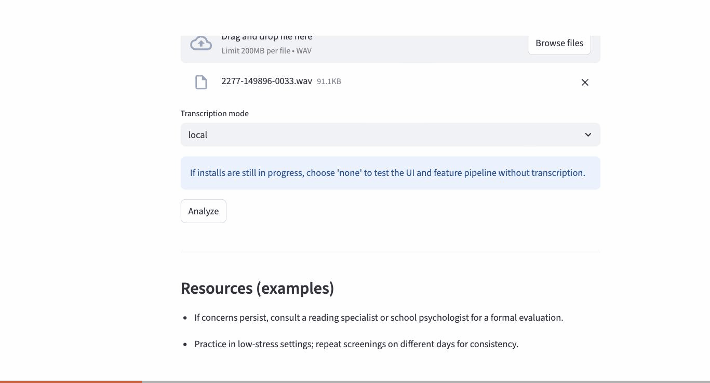

# NeuroAid AI (PhonoLens)

An AI-powered dyslexia pre-screening **prototype**: a user reads a short prompt
aloud, and the system transcribes it, extracts lexical/phoneme/acoustic
reading-fluency features, and (optionally) returns a plain-language risk
assessment -- served as a Flask REST API, with a Streamlit demo client.

**This is an informational screening prototype, not a diagnostic tool.** See
[`docs/ETHICS_PRIVACY.md`](docs/ETHICS_PRIVACY.md) for consent, privacy, and
model-validity disclosures -- in particular, the risk model is trained on
**synthetic labels**, not real clinical data (explained below).

## Demo



Uploading `data/sample_audio/real_samples/2277-149896-0033.wav` against the
matching `LIBRISPEECH_SAMPLE_DEMO` prompt (see `data/sample_prompts.txt`) --
real Whisper transcription, real feature extraction, and a real risk
assessment from the checked-in model, end to end through the Streamlit
client and Flask API. Reproduce it yourself:
```bash
gunicorn --bind=0.0.0.0:8000 wsgi:app &
PYTHONPATH=. streamlit run src/web/app_streamlit.py
```

## Tech stack
- Python 3.11, Flask + gunicorn (REST API), Docker
- OpenAI Whisper (local transcription)
- spaCy (lemmatization-aware word error rate)
- CMU Pronouncing Dictionary (phoneme mismatch proxy)
- librosa (MFCC + pause-ratio acoustic features)
- scikit-learn (RandomForestClassifier risk model)
- Anthropic Claude (agent orchestration, tool use) -- optional, see below
- Streamlit (thin demo client over the API)

## Architecture
```
Streamlit demo client  --HTTP-->  Flask REST API  -->  screening pipeline
(src/web)                         (src/api)            (src/audio, src/speech_to_text,
                                                          src/nlp, src/model)
```
The Flask API is the production surface (what the Dockerfile ships); Streamlit
is a convenience UI that talks to it over HTTP like any other client. See
[`docs/DESIGN.md`](docs/DESIGN.md) for the full pipeline breakdown.

## Setup
```bash
git clone <repo-url>
cd neuroaid-ai
python3.11 -m venv venv
source venv/bin/activate
pip install -r requirements.txt
pip install -e sdk/
python -m spacy download en_core_web_sm
```

A demo risk model is checked in at `models/risk_model.joblib` so the API
works out of the box. To regenerate it (or after changing the feature
pipeline):
```bash
python -m scripts.generate_training_data
python -m scripts.train_model
```

## Running it

**API (production surface):**
```bash
gunicorn --bind=0.0.0.0:8000 wsgi:app
# or: python -m flask --app src.api.app:create_app run --port 8000
```

**Streamlit demo client** (in a separate terminal, API must be running):
```bash
PYTHONPATH=. streamlit run src/web/app_streamlit.py
```
(`PYTHONPATH=.` is required -- Streamlit doesn't add the repo root to
`sys.path` on its own, so `from src.config import ...` would otherwise fail
with `ModuleNotFoundError: No module named 'src'`.)

**Docker** (runs the API):
```bash
docker build -t neuroaid-ai .
docker run -p 8000:8000 neuroaid-ai
```

## API

- `GET /api/v1/health` -- liveness + whether a risk model is loaded
- `GET /api/v1/prompts` -- available prompt sets (see `data/sample_prompts.txt`)
- `POST /api/v1/screen` -- multipart form: `file` (WAV), `prompt_set` or
  `prompt_text`, optional `transcription_mode` (`local`/`none`)
- `POST /api/v1/screen/report` -- same inputs, returns a PDF report

```bash
curl -X POST http://localhost:8000/api/v1/screen \
  -F "file=@data/sample_audio/real_samples/2277-149896-0033.wav" \
  -F "prompt_text=then he rang the bell no answer"
```

Errors are typed and return the appropriate HTTP status (400 invalid input,
413 payload too large, 422 unprocessable audio, 500 internal error) with a
JSON body of `{"error": ..., "type": ...}`.

## Agent orchestration + SDK

`POST /api/v1/agent/screen` (same multipart input as `/screen`) wraps the
pipeline in an Anthropic Claude agent that uses tool-use to call
`transcribe` -> `extract_features` -> `predict_risk` itself, deciding along
the way whether to call `recommend_retake` (e.g. on an empty transcript or a
tool failure) instead of forcing an assessment, and synthesizing its own
plain-language explanation via `finalize_assessment` rather than a static
template. See [`docs/DESIGN.md`](docs/DESIGN.md#agent-orchestration-srcagent)
for the full design.

Requires `ANTHROPIC_API_KEY` (see `.env.example`); without it, this one
endpoint returns 503 -- `/api/v1/screen` is unaffected either way, and no
key is needed to run the rest of the app or its test suite (the agent's
tests use a scripted fake client, not a real API call).

```bash
export ANTHROPIC_API_KEY=...
curl -X POST http://localhost:8000/api/v1/agent/screen \
  -F "file=@data/sample_audio/real_samples/2277-149896-0033.wav" \
  -F "prompt_text=then he rang the bell no answer"
```

A typed client SDK lives in [`sdk/`](sdk/README.md) (`pip install -e sdk/`)
so any downstream consumer -- your own code, or another LLM agent via the
included Anthropic/OpenAI tool-use schema -- can call the API reliably
(typed errors, retry/backoff). `sdk/examples/downstream_llm_demo.py` is a
runnable, independent Claude call consuming it as a tool.

## Privacy
Uploaded audio is written to a private temp file for the duration of a single
request and deleted immediately afterward -- nothing is persisted server-side
by default. See [`docs/ETHICS_PRIVACY.md`](docs/ETHICS_PRIVACY.md).

## On the risk model: synthetic labels, disclosed
No real dyslexia-labeled speech dataset is freely available for a project at
this scale -- genuine ones (e.g. CMU Kids Corpus, OGI Kids' Speech) sit behind
paid LDC licenses or IRB-gated research access, appropriately, since it's
pediatric health data. This project uses a documented hybrid instead:

- **Real audio**: 5 short clips from LibriSpeech `dev-clean` (CC BY 4.0) --
  see `data/sample_audio/real_samples/README.md` -- so transcription,
  phoneme mapping, and MFCC extraction all run on genuine recordings.
- **Real feature pipeline**: spaCy-based WER, CMU phoneme mismatch, and
  librosa acoustic features are computed for real, not mocked.
- **Synthetic label**: the training target is a documented, rule-based
  heuristic over those features (`scripts/generate_training_data.py`), not a
  clinical diagnosis. See `data/generated/README.md`.

The trained model demonstrates the ML pipeline mechanics end-to-end
(feature extraction -> train -> serve a plain-language risk assessment); it
is **not** a validated dyslexia screening classifier, and every API response
carrying a `risk_assessment` says so explicitly.

## Testing & CI
```bash
pytest
ruff check .
```
GitHub Actions (`.github/workflows/ci.yml`) runs lint, the full test suite,
a sanity-check retrain of the ML pipeline, and a Docker build on every push/PR.

## Project layout
- `src/api` -- Flask app, request validation, typed errors
- `src/agent` -- Claude tool-use orchestration for `/api/v1/agent/screen`
- `src/audio` -- ephemeral upload handling, diagnostics, MFCC/pause features
- `src/speech_to_text` -- Whisper wrapper, text cleaning
- `src/nlp` -- CMU phoneme mapping, spaCy pipeline, feature extraction
- `src/model` -- training + prediction (plain-language risk assessment)
- `src/web` -- Streamlit demo client
- `sdk/` -- typed client SDK + LLM tool-use schema for downstream consumers
- `scripts/` -- synthetic training-data generation, training CLI
- `docs/` -- design, ethics/privacy, pilot protocol
